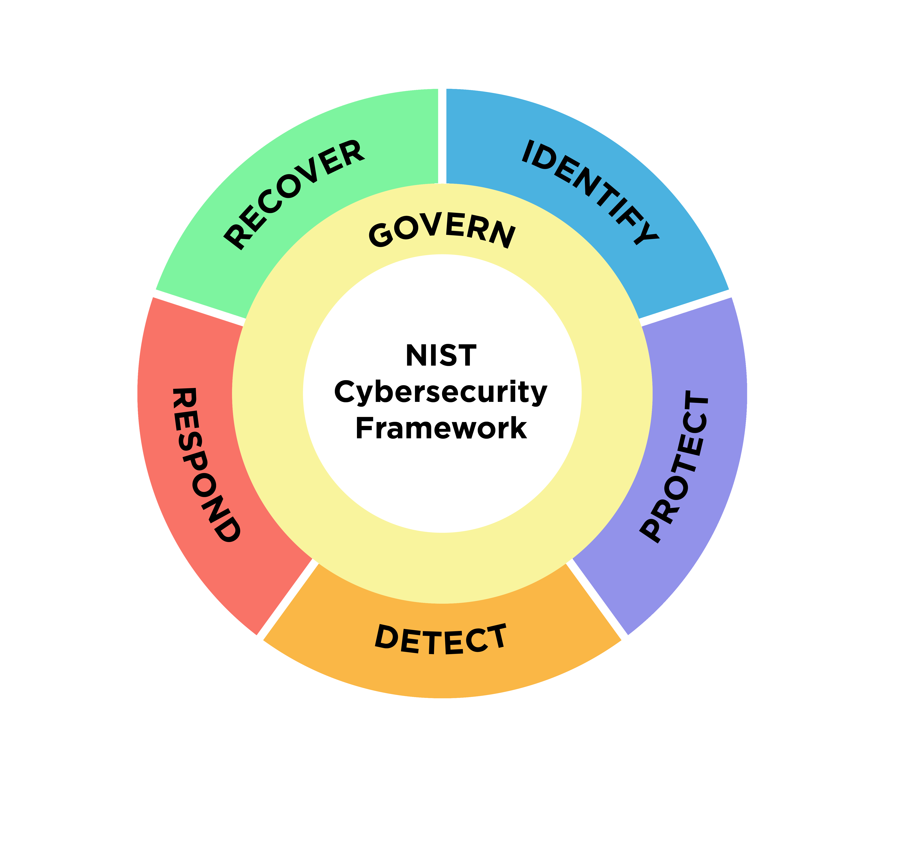

# NIST-Cybersecurity-Framework-2.0

<h2>DISCLAIMER:</h2>
The <strong>"MIT-LICENCE"</strong> guides this repository. You have the permission to use, copy, modify, merge, publish, distribute, sublicense, or reupload this content to any GitHub Repository. However, we kindly ask that you give credit to <strong>"Fixitgearware Security"</strong>. We have a strong belief that you will abide by the cybersecurity rules, ethics, and conducts. 
Copyright (c) 2024 FixitgearwareSecurity.
  
<strong>Published Date:</strong>&nbsp;06-MAY-2024.
 
<h2>For any complaints or Error Email:</h2> <strong>report@fixitgearware.com</strong>
 

 
<h2>MIT LICENCE</h2>
<a href="https://github.com/fixitgearware/NIST-CYBERSECURITY-FRAMEWORK-V1.1/blob/main/LICENSE">Read the MIT-LICENCE</a>
  

Reference Guide in Planning Organizations "Risk Assessment &amp; Risk Management" using the cybersecurity framework.

 

 
The <a href="https://www.fixitgearware.com/cybsec-news/cyber-security/the-nist-cyber-security-framework/2023/09/07/">NIST Cyber Security framework (CSF 2.0)</a>, Finalized in February 26 2024 <a href="https://www.dhs.gov/publication/executive-orders-13636-and-13691-privacy-and-civil-liberties-assessment-reports#:~:text=Executive%20Order%2013636%2C%20Improving%20Critical,neutral%20cybersecurity%20framework%2C%20and%20to">Executive Order 13636 (EO) (Executive Orders 13636 and 13691 Privacy and Civil Liberties Assessment Reports)</a>, titled <strong>“Improving Critical Infrastructure Cybersecurity”</strong> on February 12th, 2013.  

This executive order initiated the voluntary development of a Cybersecurity Framework. This framework offers a <strong>“prioritized, flexible, repeatable, performance-based, and cost-effective approach,”</strong> assisting organizations that use critical infrastructure services in managing cybersecurity risk.
  
Below is a brief summary of this framework's functions. For a detailed view of the various functions and their applications in planning your organization's risk assessment, please follow the corresponding Github repository link for each function.  

<table>
<tr>
<td><strong>FUNCTION</strong></td><td><strong>ID</strong></td><td><strong>BRIEF EXPLANATION</strong></td><td><strong>CATEGORIES</strong></td><td><strong>RESOURCE URL</strong></td>
</tr>
